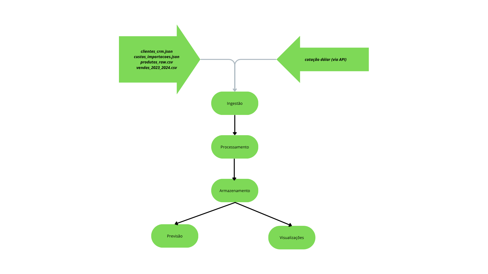
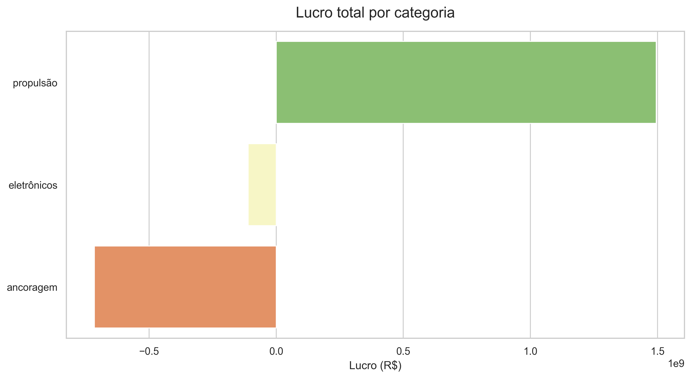

# Projeto ETL + Análise + ML para LH Nautical 
Esse projeto cria uma pipeline de dados com ETL de dados brutos, processamento para análise e criação de modelos preditivos utilizando as bases da LH Nauticals utilizando Python e DuckDB. <br>

## Visão geral
O objetivo do projeto é integrar dados brutos fragmentados do cliente **LH Nautical** em uma única base de dados, utilizando uma arquitetura modular Modern Data Stack (MDS) que permite a implementação e atualização contínua de uma pipeline de dados, estabelecendo-se como uma solução ao cenário atual de dispersão dos dados do cliente, garantindo uma "Single Source of Truth" para o cliente. O projeto inclui:<br>
* Armazenamento de Alta Performance: consolidação dos dados em uma base de dados DuckDB (aceita pandas e polars, além de possuir fácil integração com datalakes caso o cliente deseje migrar);
* Pipeline Modular: Estrutura organizada em módulos (src/), favorecendo a manutenção e escalabilidade do projeto.

* Integração com API: conversão monetária em tempo real, garantindo precisão financeira nos dados de vendas.

* Análise Preditiva: Modelos de Machine Learning integrados para previsão de demanda futura e sistema de recomendações.

* Visualização Automatizada: Geração de relatórios gráficos automatizado baseado em queries de SQL e bibliotecas de visualização (Matplotlib/Seaborn).

## Fluxo de Dados: LH Nautical Pipeline


1. Ingestão: É a entrada dos dados "crus".
* Fontes Internas: Arquivos locais em data/raw/ (CSVs de vendas, JSONs de produtos)
* Fonte Externa : Chamada para a API de Câmbio para capturar a cotação do dólar ($USD$) do dia.
    * Ação: O script main.py lê esses arquivos usando Pandas/Polars.
2. Processamento e Limpeza: Onde o dado é "lapidado" e ganha qualidade
* Limpeza: Tratamento de valores nulos (NaN), remoção de duplicatas e padronização de formatos (ex: datas e moedas)
* Transformação: Cálculo de novas colunas (ex: total_brl, total_usd)
* Armazenamento: Os dados limpos são persistidos no DuckDB (data/processed/lh_nautical.db). O DuckDB atua como o motor de alta performance aqui.
3. Modelagem de IA: Onde a inteligência é aplicada sobre os dados limpos
* Matriz de Recomendação: O código consome a tabela de vendas do DuckDB, faz o pivoting (Clientes x Produtos) e aplica a Similaridade de Cosseno
* Previsão de Vendas: O RandomForest consome o histórico, extrai sazonalidade (mês/ano) e gera a coluna previsao_qtd
* Resultado: Geração das tabelas ia_matriz_recomendacoes e ia_previsao_vendas.
4. Entrega de Valor
* Visualizações: Gráficos gerados em 'data/visualizations/'
* Dashboards: Tabelas finais prontas para serem lidas por ferramentas de BI ou consultadas via SQL puro.

## Insights de negócio
Você pode consultar a apresentação em PDF com todos os gráficos [aqui](https://drive.google.com/drive/folders/1P3SugWmGbkPw9yYKAzFlZFEV-ojyrLgZ?usp=drive_link).<br>

* Das três categorias vendidas pela LH Nautical (ancoragem, eletrônicos e propulsão), apenas "propulsão" dá lucro para a empresa. Eletrônicos dá um pouco de prejuízo e ancoragem, mais ainda.
* O Rio de Janeiro, Amapá e Espírito Santo são os estados com maior tíquete médio por compra.
* Setembro é o mês de pior faturamento histórico da LH Nautical. Depois disso, há uma ascendente até atingir o pico máximo em novembro e voltar a cair até janeiro, onde retoma um ritmo mais ou menos constante até o reinício do ciclo.
* Todos os cinco produtos mais lucrativos da empresa são motores.
* Os cinco maiores prejuízos estão na categoria ancoragem.
* Dos tipos de produto (subcategoria), apenas os **motores** dão lucro. Todo o resto causa prejuízo.
* Terça é o melhor dia de faturamento histórico, enquanto segunda é o pior.
* 4 dos 5 clientes mais rentáveis são mulheres.

## Recomendações ao cliente
* Fazer um trabalho de Data Quality nas tabelas brutas, para garantir que a excelência operacional e a consolidação dos dados, aperfeiçoando o sistema desenvolvido.
* É importante trazer para o sistema dados sobre o estoque junto ao sistema de previsões. Um estoque inteligente, calibrado com a demanda dos clientes, seria possível aumentar os lucros da LH Nautical.
* Adotar uma estrutura em nuvem para integrar melhor os dados é uma estratégia que eu recomendaria a seguir. Podemos criar um planejamento de migração, avaliando quanto tempo o projeto demoraria para se pagar. Indicaria adotar a **Databricks**, por ser parceira da Indicium AI, que vai poder oferecer a máxima expertise e eficiência na transição para a nuvem.
* Vale avaliar o direcionamento do marketing da LH Nauticals para o público feminino. É necessário uma investigação maior.
* ❗É urgente rever os preços de importação e venda dos produtos. Apenas equipamentos de propulsão, da subcategoria motores, fecham com um saldo positivo no e-commerce.❗

## Modelos de Machine Learning e Aplicabilidade
O projeto utiliza duas abordagens complementares de Inteligência Artificial para transformar dados históricos em ações preditivas e personalizadas.

1. Sistema de Recomendação (Filtragem Colaborativa)
Este modelo utiliza a técnica de Similaridade de Cosseno aplicada a uma matriz esparsa de interações (Cliente x Produto). O objetivo é identificar padrões de consumo "vizinhos".
* Como funciona: O algoritmo calcula a distância matemática entre o vetor de compras de diferentes itens. Se produtos são frequentemente comprados juntos ou por perfis similares, eles recebem um score de similaridade alto.

2. Previsão de Demanda (Série Temporal com Regressão)
* O modelo utiliza algoritmo Random Forest Regressor para prever o volume de vendas futuro. O modelo é treinado com dados de sazonalidade (mês, dia da semana) e variáveis de preço.

* Como funciona: A "Floresta Aleatória" cria múltiplas árvores de decisão que analisam como as vendas se comportaram em cenários passados (ex: Verão vs. Inverno) para estimar a quantidade (previsao_qtd) para datas futuras.

### Visualização de Resultados de Machine Learning
| Modelo | Input (Entrada) | Output (Predição) | Decisão Sugerida |
| --- | --- | --- | --- |
| Recomendação | Compra de: Bússola | Sugerir: Sinalizador (92%) | Criar "Kit Navegador Seguro" |
| Previsão | Mês: Dezembro | Venda: 85 Motores | Aumentar estoque em 20% em Nov |
| Previsão | Preço: R$ 5.000 | Venda: 12 un/semana | Manter preço; demanda está estável |


## Arquitetura do projeto
🗂️ lh_nautical_project/ <br>
├── 📂 data/<br>
│   ├── 📂 raw/                 <- Dados brutos (CSV, JSON)<br>
│   ├── 📂 processed/           <- Banco de dados DuckDB consolidado<br>
│   └── 📂 visualizations/      <- Gráficos gerados automaticamente (.png)<br>
├── 📂 imgs_readme/             <- Imagens contidas dentro do documento README.md<br>
├── 📂 notebooks/               <- Notebook de exploração dos datasets brutos<br>
├── 📂 src/<br>
│   ├── 📂 ETL/                 <- Scripts de ETL em pandas <br>
│   ├── 📂 models/              <- Modelos preditivos <br>
│   ├── 📂 sql_db/              <- Conexão com banco e queries SQL puras<br>
│   └── 📂 visualizations/      <- Geração de gráficos (Seaborn/Matplotlib)<br>
├── main.py                      <- Orquestrador principal do pipeline<br>
├── dicionario_dados.xlsx        <- Dicionário das tabelas dentro do banco de dados<br>
├── README.md                    <- Arquivo markdown de documentação do projeto (você está aqui! 🟢)<br>
└── requirements.txt             <- Dependências do projeto<br>

## Problemas conhecidos, desafios e updates futuros
* 🕝 **Tempo de execução**: a chamada do API para ler a cotação do dólar no dia da compra dos produtos é bastante demorada. Seria interessante encontrar mecanimos para reduzir o tempo de execução do script.
* ❌ **Dependência da IA**: houve muita dependência de IA Generativa para a criação de modelos preditivos. Seria interessante um maior estudo da minha parte e adequação para entregar um resultado mais relevante, com maior capacidade de análise, e mais eficiente.<br>
* 🔒 **LGPD**: além disso, em um projeto real, dados sensíveis do cliente precisariam passar por um processo de anonimização antes de serem alimentados a uma IA Generativas para respeito a LGPD e por questões de segredo industrial. Por se tratar de um cliente fictício, esses dados foram alimentados à IA sem tratamento. <br>
* 📊 **Refino visual**: alguns gráficos poderiam ser melhor ajustados. Por exemplo, existe termos em exibição como "1e6, que decorrem da notação científica das bibliotecas, além de que seria ideal adaptar as apresentações ao manual da marca de um cliente real, com um design mais personalizado e uma dinâmica maior entre os slides.
* 📈 **Interface de Usuário**: Integrar os resultados do DuckDB em uma ferramenta de BI para visualização em tempo real pela diretoria.
* 🔎**Clareza ao rodar**: seria interessante que o log, os prints e previsões de erro fossem mais detalhados para o acompanhamento no terminal e no próprio log.
* ⚙️ **Automatização do script**: falta um aspecto crucial a ser implementado no script, que é a automatização de seu acionamento. É importante ver junto aos stakeholders quais ferramentas seriam mais indicadas para essa automatização, se uma simples automatização de sistema operacional funcionaria ou se precisamos de uma solução mais robusta, como Docker + Airflow.
* 🪛 **Aperfeiçoamentos técnicos:**<br>
    * No geral, seria importante aplicar restrições ao input de dados na tabela, para evitar tipagens errôneas e reduzir o trabalho de limpeza. <br>
    * Em subcategorias de produtos, na tabela de produtos, o termo "Piloto Automático" está sendo reduzido para "Piloto".<br>
    * Na tabela de custos_importacoes, a categoria "taxa_do_dia" representa o fallback da API. É importante avaliar se o cálculo está sendo feito com base no fallback da cotação e substituir pela cotação adquirida pela API. <br>
    * Na tabela de custos_importacoes, a chave primária apresenta o mesmo título da chave primária da tabela produtos. Seria desejável avaliar o quanto isso impacta na modelagem de dados. Possivelmente, uma mesclagem dessas tabelas pode ser feita sem grandes impactos no modelo.<br>
    * Existe um parâmetro chamado "palettes" na função "barplot", que gera os gráficos, que vai ser removida em futuras versões do Seaborn. É importante ajustar para tornar a função mais compatível com versões futuras dessa biblioteca.<br>
    * Implementar um sistema de integração com macros de planilha é importante para que o time comercial consiga usar com tranquilidade os modelos preditivos.<br>
<br>
## Instalação
1. **Clone o repositório**
```
git clone https://github.com/yourusername/desafio-tecnico-indicium.git
cd desafio_tecnico_indicium
```
2. ***(Optional) Crie um virtual environment***
```python -m venv venv
source venv/bin/activate  # On Windows: venv\Scripts\activate
```

3. **Instale as dependências do projeto**
```
pip install -r requirements.txt
```

4. **Execute o script main.py**
